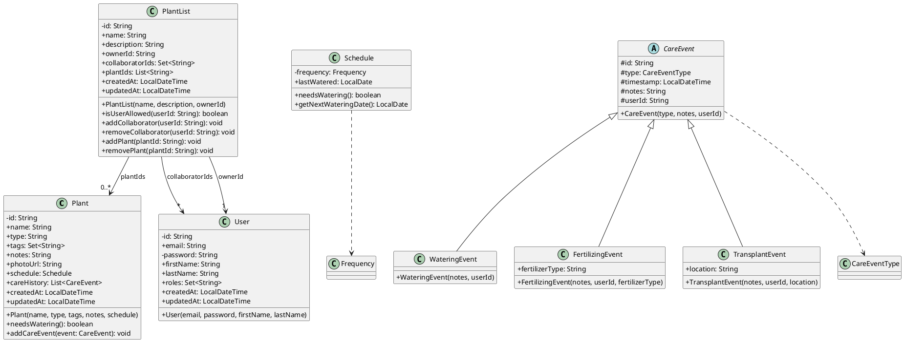

# UML Class Diagram

Below is the static structure of the backend domain model classes, showing classes, attributes, methods, and their relationships.

## Classes

+-------------------------------------------+
|                  Plant                    |
+-------------------------------------------+
| - id: String                              |
| + name: String                            |
| + type: String                            |
| + tags: Set<String>                       |
| + notes: String                           |
| + photoUrl: String                        |
| + schedule: Schedule                      |
| + careHistory: List<CareEvent>            |
| + createdAt: LocalDateTime                |
| + updatedAt: LocalDateTime                |
+-------------------------------------------+
| + Plant(name, type, tags, notes, schedule) |
| + needsWatering(): boolean                |
| + addCareEvent(event: CareEvent): void    |
+-------------------------------------------+

+-------------------------------------------+
|                 PlantList                 |
+-------------------------------------------+
| - id: String                              |
| + name: String                            |
| + description: String                     |
| + ownerId: String                         |
| + collaboratorIds: Set<String>            |
| + plantIds: List<String>                  |
| + createdAt: LocalDateTime                |
| + updatedAt: LocalDateTime                |
+-------------------------------------------+
| + PlantList(name, description, ownerId)   |
| + isUserAllowed(userId: String): boolean  |
| + addCollaborator(userId: String): void   |
| + removeCollaborator(userId: String): void|
| + addPlant(plantId: String): void         |
| + removePlant(plantId: String): void      |
+-------------------------------------------+

+-------------------------------------------+
|                   User                    |
+-------------------------------------------+
| - id: String                              |
| + email: String                           |
| - password: String                        |
| + firstName: String                       |
| + lastName: String                        |
| + roles: Set<String>                      |
| + createdAt: LocalDateTime                |
| + updatedAt: LocalDateTime                |
+-------------------------------------------+
| + User(email, password, firstName, lastName)|
+-------------------------------------------+

+-------------------------------------------+
|                 Schedule                  |
+-------------------------------------------+
| - frequency: Frequency                    |
| + lastWatered: LocalDate                  |
+-------------------------------------------+
| + needsWatering(): boolean                |
| + getNextWateringDate(): LocalDate       |
+-------------------------------------------+

+-------------------------------------------+
|                CareEvent                  |
+-------------------------------------------+
| # id: String                              |
| # type: CareEventType                     |
| # timestamp: LocalDateTime                |
| # notes: String                           |
| # userId: String                          |
+-------------------------------------------+
| + CareEvent(type, notes, userId)          |
+-------------------------------------------+

+-------------------------------------------+
|             WateringEvent                 |
+-------------------------------------------+
| + (inherits CareEvent)                    |
+-------------------------------------------+
| + WateringEvent(notes, userId)            |
+-------------------------------------------+

+-------------------------------------------+
|           FertilizingEvent                |
+-------------------------------------------+
| + fertilizerType: String                  |
+-------------------------------------------+
| + FertilizingEvent(notes, userId, fertilizerType)|
+-------------------------------------------+

+-------------------------------------------+
|            TransplantEvent                |
+-------------------------------------------+
| + location: String                        |
+-------------------------------------------+
| + TransplantEvent(notes, userId, location) |
+-------------------------------------------+

## Relationships

- Inheritance (is-a):
  - WateringEvent, FertilizingEvent, TransplantEvent ──|> CareEvent

- Composition (strong ownership):
  - Plant *■── Schedule
  - Plant *■── CareEvent (history stored within Plant)

- Association (has-a):
  - PlantList ── plantIds (String references to Plant)
  - PlantList ── collaboratorIds / ownerId (String references to User)

- Dependency (uses):
  - CareEvent ..> CareEventType (enum)
  - Schedule ..> Frequency (enum)

## Legend
- + : public visibility
- - : private visibility
- # : protected visibility

## OO Design Comments

- Classes model domain entities cohesively; each has clear responsibility.
- Value objects (Schedule) are embedded in Plant (composition) for lifecycle management.
- Events inherit from an abstract CareEvent, promoting reuse and polymorphism.
- Use of primitive IDs (String) for associations (PlantList → Plant, User) deviates from direct object references; chosen for persistence simplicity in MongoDB and to avoid deep joins.
- Lombok (`@Data`) hides boilerplate getters/setters; actual methods are generated at compile time.
- Model classes contain business logic (e.g., `needsWatering()`), blending data and behavior in classic OO style.

## PlantUML Diagram

